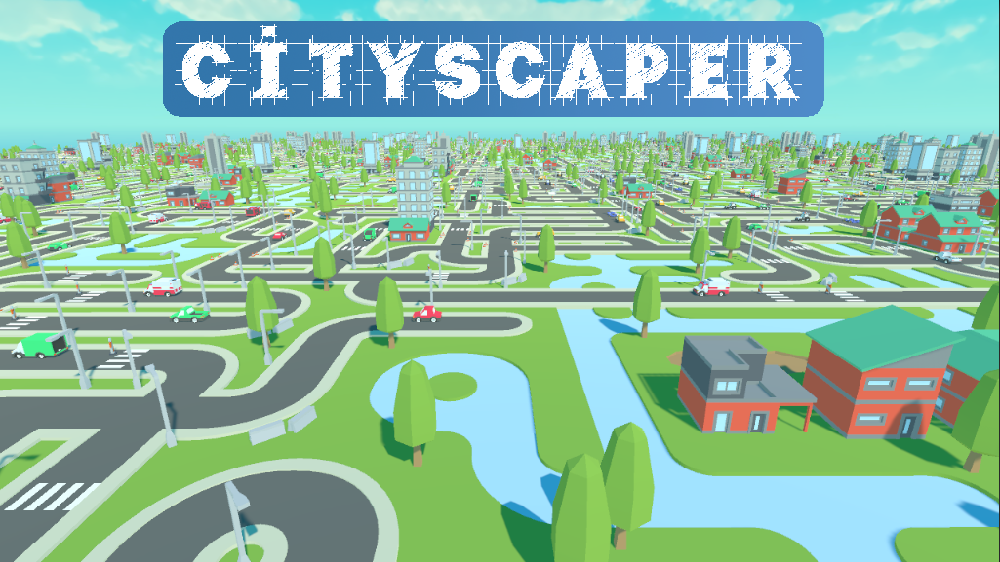
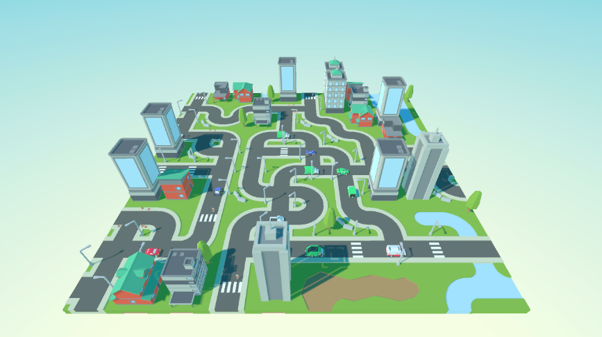

# CityScaper
An experimental project for using Wave Function Collapse to procedurally generate city maps. Made in Unity.

## Play Now

Download the application for free on Windows, Mac and Linux from: https://dispixel.itch.io/cityscaper

  
  

## Features

### Sandbox Tools

A sandbox world with multiple parameters to generate unique and random worlds with the wave function collapse algorithm.

### Exploration

Explore your randomly generated worlds with a first person free flying camera to get the perfect view of the action.

## Reference

https://github.com/mxgmn/WaveFunctionCollapse

## Credit

This project uses 3D assets provided for free by [Kenny.](https://www.kenney.nl/)

<ul>
  <li>https://www.kenney.nl/assets/car-kit</li>
  <li>https://www.kenney.nl/assets/3d-road-tiles</li>
  <li>https://www.kenney.nl/assets/city-kit-commercial</li>
  <li>https://www.kenney.nl/assets/city-kit-roads</li>
  <li>https://www.kenney.nl/assets/city-kit-suburban</li>
</ul>
